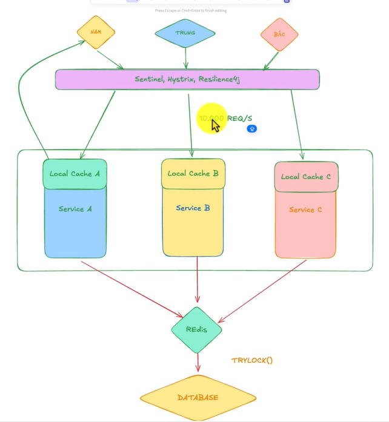

# Kiến trúc 3 lớp phòng thủ (High Load Defense)



---

## 1. Request Flow

```
User (NAM / TRUNG / BAC)
          │
          │ HTTP Request
          ▼
┌─────────────────────────────────────────────┐
│     Sentinel / Hystrix / Resilience4j       │
│                                             │
│  [Rate Limiter]                             │
│    vuot quota? ──────────────────► 429 ❌   │
│    khong → di tiep                          │
│                                             │
│  [Circuit Breaker]                          │
│    OPEN? ────────────────────► fail fast ❌ │
│    CLOSED → di tiep                         │
└─────────────────────────────────────────────┘
          │
          │ Load Balancer phan tan deu
          ├───────────┬───────────┐
          ▼           ▼           ▼
      Service A   Service B   Service C
          │
          │ (lay Service A lam vi du)
          ▼
┌─────────────────────────────────────────────┐
│           Local Cache A (Caffeine)          │
│                                             │
│  HIT ──────────────────────► Response ✓     │
│  MISS → xuong Redis                         │
└─────────────────────────────────────────────┘
          │ cache miss
          ▼
┌─────────────────────────────────────────────┐
│                   Redis                     │
│                                             │
│  HIT ──────────────────────► Response ✓     │
│  MISS → can vao DB                          │
│                                             │
│  TRYLOCK(key, waitTime, leaseTime)          │
│    khong lay duoc lock ──────► null/retry   │
│    lay duoc → double-check Redis            │
│      HIT ──────────────────► Response ✓     │
│      MISS → vao DB                          │
└─────────────────────────────────────────────┘
          │ chi 1 request/key xuong day
          ▼
┌─────────────────────────────────────────────┐
│                  Database                   │
│                                             │
│  Query DB → lay data                        │
│    → set Redis cache  (ke ca null)          │
│    → release lock                           │
│    → Response ✓                             │
└─────────────────────────────────────────────┘
```

---

## 2. Tóm tắt từng lớp

| Lớp | Vào | Ra | Lọc được | Công nghệ |
|-----|-----|----|----------|-----------|
| Rate Limiter + CB | 500,000 | 10,000 | Bot, vượt quota, cascade failure | Resilience4j |
| Local Cache | 10,000 | 2,000 | Data hot, ít thay đổi | Caffeine |
| Redis Cache | 2,000 | 200 | Phần lớn read request | Redis |
| Distributed Lock | 200 | 1 | Cache stampede | Redisson |
| **Database** | **~1** | — | — | MySQL |

> Số liệu chỉ mang tính minh họa, tỷ lệ thực tế phụ thuộc vào cache hit rate và config rate limit.

### Quy tắc đặt từng lớp

- **Rate Limiter** — đặt ở tầng **Controller/Filter**, chặn trước khi vào business logic
- **Circuit Breaker** — đặt bao quanh **lời gọi đến dependency** (DB, external service)
- **Local Cache** — chỉ dùng cho data **ít thay đổi** (config, danh mục...), không dùng cho tồn kho
- **Distributed Lock** — chỉ đặt ở **điểm ghi** hoặc khi cache miss, không wrap toàn bộ flow

---

## 3. Tại sao Local Cache không dùng cho tồn kho?

```
Service A update ton kho → 99  → local cache A = 99
Service B, C khong biet  → local cache B, C van = 100  ← inconsistent ❌
```

Redis là nguồn sự thật chung — tất cả instance đều đọc/ghi cùng 1 chỗ.

---

## 4. Tiêu chí chọn Local Cache

### 6 tiêu chí cần quan tâm

**1. maximumSize** — giới hạn số lượng item

```
maximumSize = 1000
Item thứ 1001 vào → tự xóa item ít dùng nhất (W-TinyLFU)
```

**Dùng khi:** các item có size tương đối đều nhau (VD: cùng là EventDto, TicketDto).
**Không dùng khi:** item có size chênh lệch lớn (1 item có thể là 1KB, item khác là 500KB) → dùng `maximumWeight` thay thế.

---

**2. maximumWeight (MB)** — giới hạn tổng dung lượng RAM

```
maximumSize = 1000 item  ← không phân biệt size
maximumWeight = 100MB    ← kiểm soát RAM thực tế
```

**Dùng khi:** data có size không đều — VD: cache cả response JSON, có event nhỏ 2KB, có event lớn 200KB.
**Không dùng khi:** đã dùng `maximumSize` (hai cái xung đột nhau, chỉ dùng 1 trong 2).

Phải tự định nghĩa hàm tính weight cho mỗi item:
```java
.weigher((key, value) -> value.toString().length())
.maximumWeight(100 * 1024 * 1024) // 100MB
```

---

**3. expireAfterWrite (TTL)** — xóa sau X giây kể từ lúc set, dù có được đọc hay không

```
set("ticket:1", data)  ← t=0
get("ticket:1")        ← t=29s → còn
get("ticket:1")        ← t=31s → miss (đã expire dù vừa đọc)
```

**Dùng khi:** data có "độ tươi" cố định, cần đảm bảo sau X giây là đã stale dù có ai dùng hay không.
VD: thông tin sự kiện cập nhật mỗi 5 phút → TTL = 5 phút. Config hệ thống reload mỗi 1 phút → TTL = 1 phút.
**Không dùng khi:** muốn giữ data hot trong RAM lâu hơn nếu vẫn đang được dùng → kết hợp thêm `expireAfterAccess`.

---

**4. expireAfterAccess** — xóa sau X giây kể từ lần đọc/ghi cuối cùng

```
set("ticket:1", data)  ← t=0,  timer reset
get("ticket:1")        ← t=29s, timer reset
-- không ai đọc --
                       ← t=59s → expire (30s không ai dùng)
```

**Dùng khi:** muốn tự động dọn dẹp data ít dùng khỏi RAM — item nào không ai hỏi tới thì tự expire.
VD: cache 10,000 sự kiện nhưng thực tế chỉ ~500 sự kiện được truy cập thường xuyên → item còn lại tự dọn sau 30 phút.
**Không dùng khi:** data cần đảm bảo tươi theo thời gian tuyệt đối → dùng `expireAfterWrite`.

> Kết hợp cả 2: `expireAfterWrite` đảm bảo data không stale quá lâu, `expireAfterAccess` dọn item không ai dùng đến.

---

**5. Tự động load từ DB (CacheLoader)** — và tại sao phải set cache kể cả khi null

```
getItemCache("ticket:9999")    → miss
getItemDatabase("ticket:9999") → null  (ID không tồn tại)
setItemCache("ticket:9999", null)      ← BẮT BUỘC dù null
```

**Nếu không set null:**
```
Request 1: miss cache → query DB → null → không cache
Request 2: miss cache → query DB → null → không cache
Request N: mỗi request đều đánh thẳng vào DB mãi mãi
→ Hacker gửi GET /ticket/9999999 liên tục → DB sập 💥
```

**Nếu set null vào cache:**
```
Request 1: miss → query DB → null → cache(key, null, TTL=30s)
Request 2: hit cache → trả null ngay → DB không nhận query ✅
```

**Dùng khi:** có thể load data từ DB một cách tự động khi cache miss — thay vì gọi `cache.put()` thủ công, để Caffeine tự gọi loader.
**Bắt buộc dùng** nếu muốn dùng `refreshAfterWrite` (refreshAfterWrite không hoạt động nếu không có CacheLoader).

> **Lưu ý:** null cache phải có TTL ngắn (30s-5 phút). Nếu TTL mãi mãi thì khi DB có data thật, cache vẫn trả null.

---

**6. ConcurrencyLevel** — số thread đọc/ghi cache đồng thời không bị block nhau

```
ConcurrencyLevel = 4

Thread 1 ghi key "A"  ┐
Thread 2 ghi key "B"  ├─ chạy song song, không chờ nhau ✅
Thread 3 đọc key "C"  │
Thread 4 đọc key "D"  ┘
Thread 5 → phải chờ 1 trong 4 thread kia xong
```

Caffeine dùng **striped locking** — chia cache thành nhiều segment, mỗi segment lock riêng → thread ghi key khác nhau không block nhau.

**Dùng khi:** service có nhiều thread đồng thời đọc/ghi cache (hầu hết production service đều vậy).
**Thực tế:** ít khi cần chỉnh tay — Caffeine tự tune theo số CPU core. Chỉ điều chỉnh nếu profiling cho thấy lock contention thực sự là bottleneck.

---

---

**7. refreshAfterWrite** — async background refresh, tránh miss spike

```
expireAfterWrite: hết TTL → xóa → request tiếp theo MISS → chờ load DB (block)
refreshAfterWrite: hết TTL → vẫn trả data cũ ngay → background thread reload DB

→ Không có request nào bị block chờ, không có thundering herd tại local cache
```

Khác biệt quan trọng: `expireAfterWrite` gây ra **cache miss đồng loạt** khi TTL hết, `refreshAfterWrite` tránh điều đó bằng cách trả data cũ trong lúc reload.

**Dùng khi:** thỏa đủ 3 điều kiện:
1. Data thay đổi định kỳ nhưng stale vài giây là chấp nhận được (danh mục, config, event listing)
2. Load DB tốn thời gian, không muốn bất kỳ request nào bị block chờ
3. Traffic đủ cao — `refreshAfterWrite` chỉ trigger khi có request đến sau khi hết TTL, traffic thấp thì vẫn stale

**Không dùng khi:** data cần chính xác tuyệt đối (tồn kho, trạng thái đặt vé) hoặc không có CacheLoader.

> Kết hợp cả hai: `expireAfterWrite = 10 phút` (hard cap), `refreshAfterWrite = 1 phút` (soft refresh).

---

**8. Cache Statistics / Metrics** — đo hiệu quả thực tế

```
cache.stats()
  → hitRate()       : tỷ lệ hit, lý tưởng > 90%
  → missRate()      : tỷ lệ miss
  → evictionCount() : số item bị xóa do đầy → tăng maximumSize nếu cao
  → averageLoadPenalty(): thời gian trung bình load từ DB khi miss
```

**Dùng khi:** production — luôn bật. Nếu không monitor, không biết cache có đang hoạt động hiệu quả không, không biết khi nào cần tăng `maximumSize` hay giảm TTL.

Caffeine tích hợp Micrometer → expose thẳng ra Prometheus/Grafana:

```java
Caffeine.newBuilder()
    .recordStats()  // ← bật stats
    ...
```

Các chỉ số cần alert:
- `hitRate < 80%` → cache không hiệu quả, xem lại key design hoặc TTL
- `evictionCount` tăng liên tục → tăng `maximumSize`
- `averageLoadPenalty` cao → DB chậm, cần index hoặc query optimization

---

**9. Cache Invalidation Strategy** — khi có write thì invalidate local cache thế nào?

Doc trên chỉ mô tả **read path**. Khi data thay đổi:

```
Service A update DB → xóa Redis OK
Nhưng local cache B, C vẫn giữ data cũ đến hết TTL ← inconsistent
```

Các chiến lược:

| Chiến lược | Cách hoạt động | Khi nào dùng |
|------------|---------------|--------------|
| Short TTL | Chấp nhận stale tối đa X giây | Data không critical (config, danh mục) |
| Redis Pub/Sub | Broadcast invalidation event đến tất cả instance | Data cần consistency cao hơn |
| Write-through | Khi write DB thì update cả local cache luôn | Chỉ khả thi nếu 1 instance xử lý write |

> Tồn kho, trạng thái đặt vé → **không dùng local cache**, dùng Redis làm nguồn sự thật chung (đã đề cập ở mục 3).

---

**10. Object Mutability** — bug thầm lặng

Caffeine lưu **reference**, không deep-copy. Nếu modify object sau khi lấy ra:

```java
EventDto dto = cache.get("event:1");
dto.setName("modified");  // ← modify in-place
// → cache bị ô nhiễm, tất cả request sau nhận data sai 💥
```

**Dùng khi:** bất cứ khi nào cache object có thể bị modify sau khi trả ra — đặc biệt khi code có pattern lấy từ cache rồi transform trước khi trả response.

Quy ước: cache **immutable object** (Java record, hoặc không gọi setter sau khi cache), hoặc luôn trả về **defensive copy**:
```java
// Option 1: dùng record (immutable by default)
public record EventDto(Long id, String name) {}

// Option 2: defensive copy khi get
EventDto dto = cache.get(key);
return new EventDto(dto.getId(), dto.getName()); // copy ra trước khi trả
```

---

### Package nào đáp ứng đủ các tiêu chí?

| Tiêu chí | Caffeine | Guava Cache | Ehcache |
|----------|:--------:|:-----------:|:-------:|
| maximumSize | ✅ | ✅ | ✅ |
| maximumWeight | ✅ | ✅ | ✅ |
| expireAfterWrite | ✅ | ✅ | ✅ |
| expireAfterAccess | ✅ | ✅ | ✅ |
| refreshAfterWrite | ✅ | ❌ | ❌ |
| CacheLoader (auto load DB) | ✅ | ✅ | ✅ |
| Set null value | ✅ | ✅ | ✅ |
| ConcurrencyLevel | ✅ tự động | ✅ | ✅ |
| Cache Statistics / Metrics | ✅ Micrometer | ⚠️ basic | ✅ |
| Spring Boot tích hợp sẵn | ✅ mặc định | ✅ | ⚠️ cần config thêm |
| Persist xuống disk | ❌ | ❌ | ✅ |

**Caffeine** là lựa chọn mặc định — đáp ứng đủ 10 tiêu chí, tích hợp sẵn Spring Boot, có `refreshAfterWrite` và Micrometer metrics mà Guava Cache không có.
**Ehcache** chỉ cần khi yêu cầu persist cache xuống disk hoặc L2 cache.
